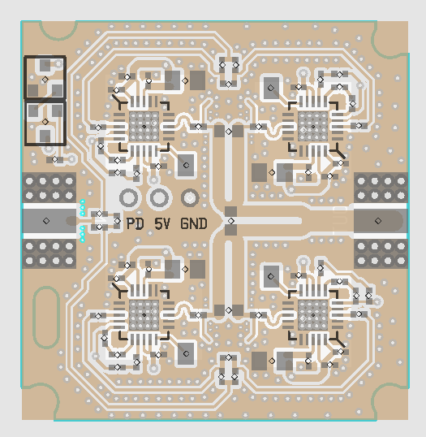

# se5004_pa
* 5.8GHz PA using 4 x SE5004L
* Output power > 5W
* Gain 25dB typ

* 6dB resistive power splitter on input side
* Wilkinson power combiners on output side

### PCB stackup
* 4 layers
* FR4
* 1.5mm total thickness
* 0.2mm top/bottom prepreg thickness

---
To open schematics, it is necessary to add all gEDA symbols here to your symbol library: https://github.com/gabriel-tenma-white/sym

To edit PCB layouts, make sure "packages" is a symlink to a cloned repository of: https://github.com/gabriel-tenma-white/packages2
